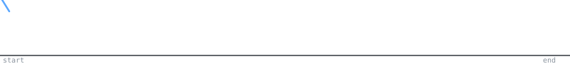

<h1 align="center">Hey there 👋</h1>

  AI/ML Enthusiast &nbsp;•&nbsp; Cybersecurity &nbsp;•&nbsp; Embedded Systems

  I build practical systems and explore how software meets hardware.

---

## ⚡ About Me

- 🤖 Focused on AI/ML and real-world applications
- 🔐 Exploring Cybersecurity concepts and systems
- 🔌 Strong interest in Embedded Systems and hardware integration
- 🌐 Use web technologies to build and showcase projects

---

## 🛠️ Tech Stack

### 💻 Languages

### 🌐 Web

### 🤖 AI/ML

### 🔧 Tools

---

## 🚀 Projects

| Project | Description | Tech |
|--------|-------------|------|
| 🏟️ Smart Stadium System | AI-powered crowd management + live dashboard | Python, AI/ML, Web |
| 🤖 Line Follower Robot | Autonomous robot using 8051 MCU + IR sensors | C, 8051, Embedded |
| 🌐 Portfolio Website | Personal showcase of projects and skills | HTML, CSS, JS |

---

## 🔥 Contribution Graph

  

---

## ⚡ Fun Line

  <code>while(alive) { learn(); build(); }</code>

